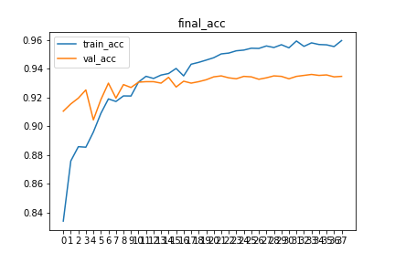
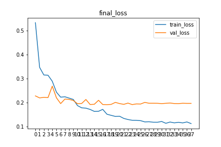

# Intel Image Scene Classification

kaggle의 Image Scene Classification of Multiclass 데이터셋을 사용하여 장면 분류 모델을 만듭니다.

### 라이브러리

python 3.7

tensorflow 2.2

matplotlib

json

### 데이터셋

https://www.kaggle.com/puneet6060/intel-image-classification

위 링크에서 데이터를 받아

dataset 디렉토리에 위치 시켜주세요.

### 파일 설명

test.py ~ test6.py는 성능이 좋은 하이퍼파라미터를 걸러내기 위한 실험 소스코드입니다.

최종모델은 final.py 한 소스코드 파일에 정리 되어 있습니다.

### 모델 구조

ResNet50 + Dense Layer + Dropout (0.5) + Dense Layer

### 모델 성능

max train accuracy : 95.97 %

max validation accuracy : 93.62 %

### ToDo

PyQt로 장면 분류기 만들기